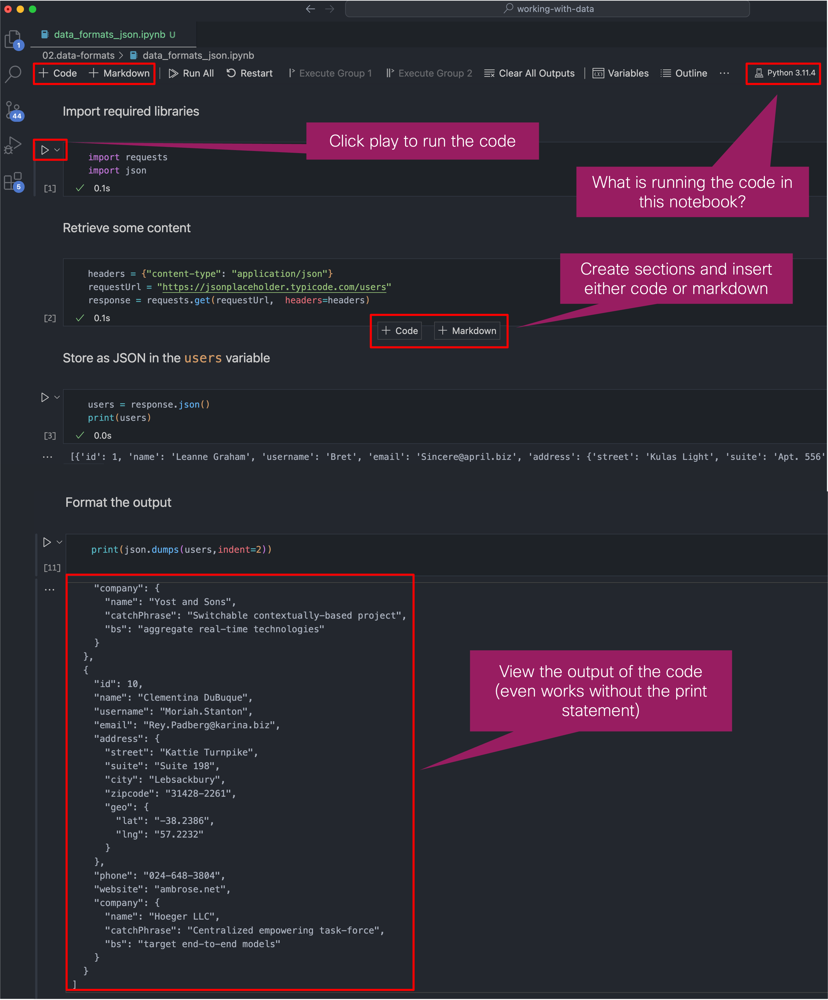
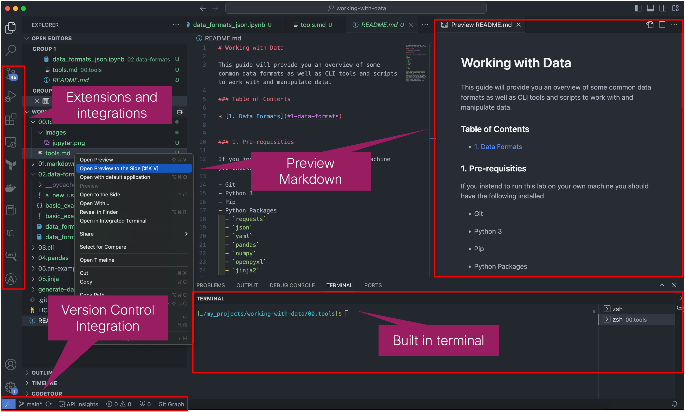
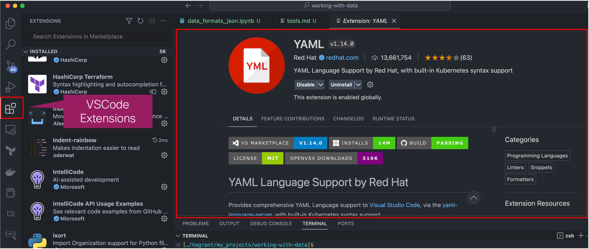
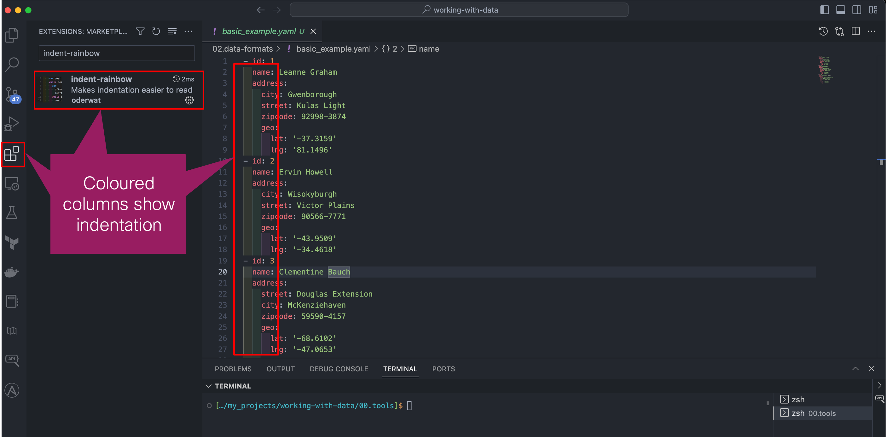
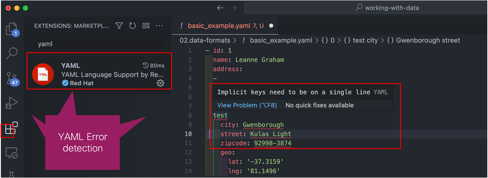
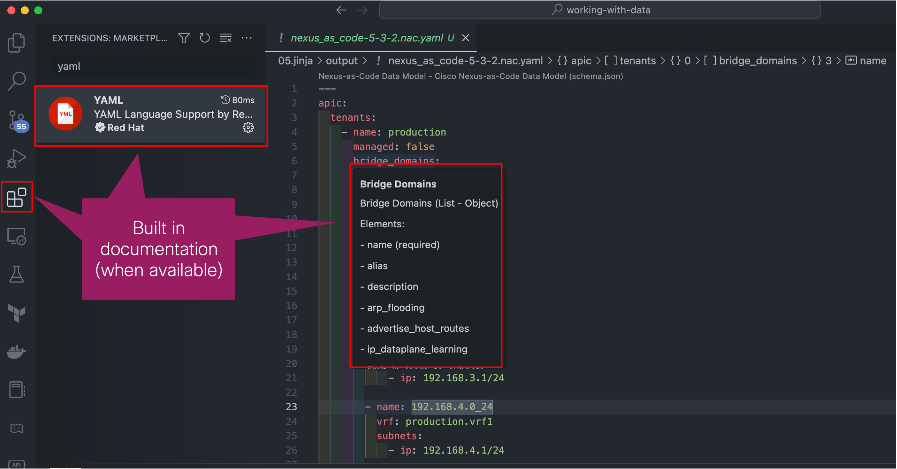

# Tools

This is an overview of some tools used in this lab which make it easier when working with data. 

# Jupyter Notebooks

# Visual Studio Code (VSCode)

## VSCode Extensions

### `indent-rainbow`

### `yaml`

