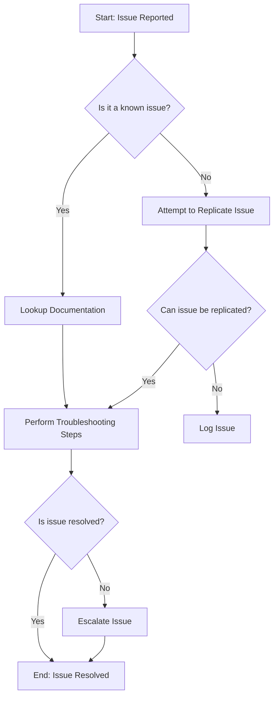

# This is a header
## Use \# to create a header 
### This is the third level
#### Use a backslash \ to escape special characters like \#
##### You can have up to 6 headers
###### But keep it simple, you probably only need the first 3

### Lists
- Hyphens help you create bullet points or unordered lists
  - They can also be indented 
  * You could also use an asterisk
- Do you need to use **bold** or *italics*?


1. You can also have
2. numbered 
3. lists

### Highlighting 
Want to `highlight` some text? Just use the `backtick`, \`your words here\`

> Note: a backtick \` is not the same as a single quote \' which is not the same as a doublequote \" which is not the same as a Windows smart quote 

> By the way, if you want to create a note like this just use the greater than/angled bracket, \>

>> You can also add multiple levels

### Links
To create a link to another page, enter the text between square `[]` brackets followed by the URL in parentheses `()`

You can read more about this in the [Markdown Guide](https://www.markdownguide.org/)

### Combinations
You can also use links and lists to create your own Table of Contents

#### Table of Contents 
* [First use an asterisk](#this-is-a-header)
* [And then a link to the header](#use--to-create-a-header)
  * [You can also have sub-items](#note-that--wont-print-but--will)
* [Include whichever items you want to](#use-a-backslash--to-escape-special-characters-like)

### Coding
If you want to include code blocks just use three backticks, \``` (You can also include the language for highlighting)

```python
import requests
import json
import yaml

headers = {"content-type": "application/json"}
requestUrl = "https://jsonplaceholder.typicode.com/users"
response = requests.get(requestUrl,  headers=headers)

users = response.text
print(type(users))
```

```yaml
id: 14
name: Alice
email: alice@user.biz
phone: 024-648-3804
username: alice.user
website: website.com
address:
    city: Some City
    geo:
    lat: '-38.2386'
    lng: '57.2232'
    street: 123 Fake St
    suite: ''
    zipcode: 31428-2261
company:
    bs: ''
    catchPhrase: ''
    name: Alice's Company

```

### Diagrams

